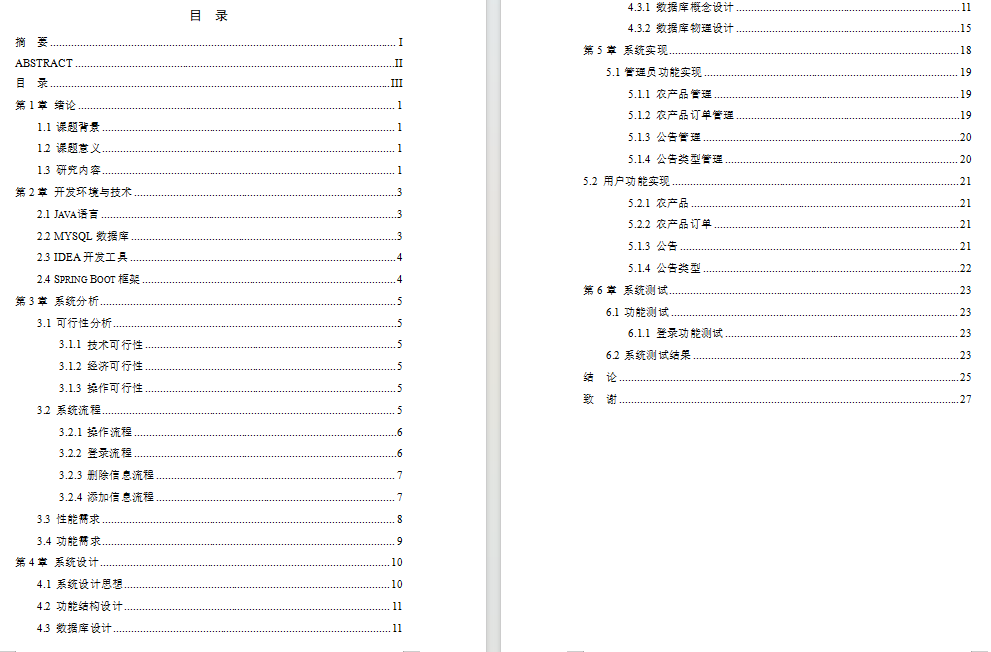
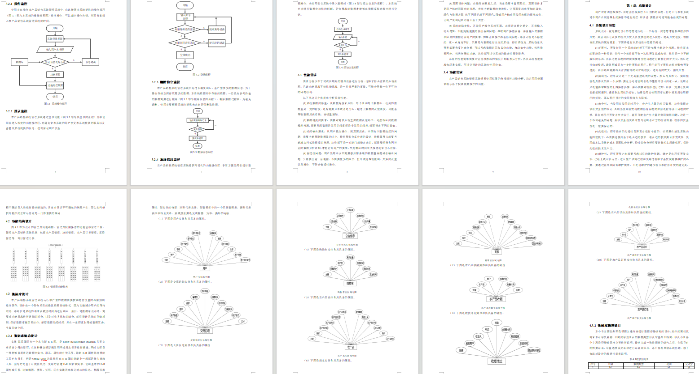
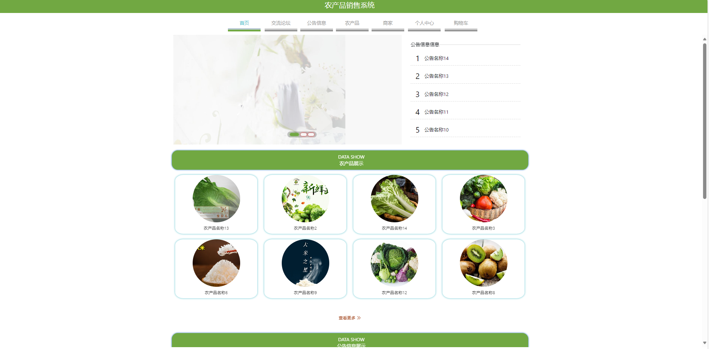
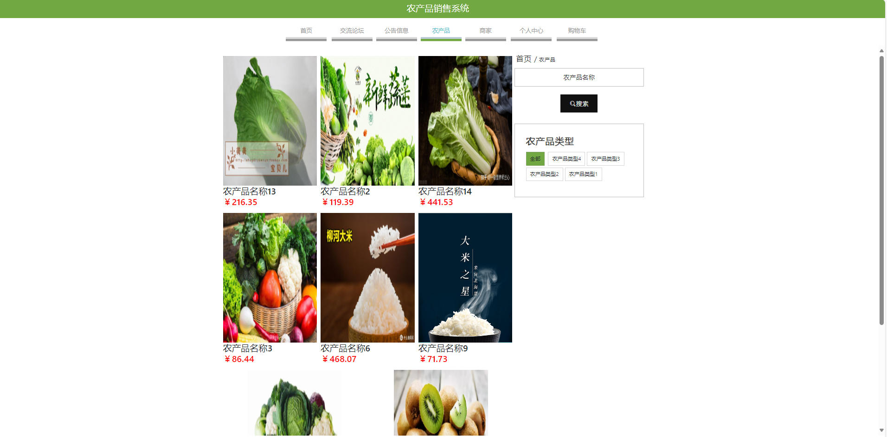
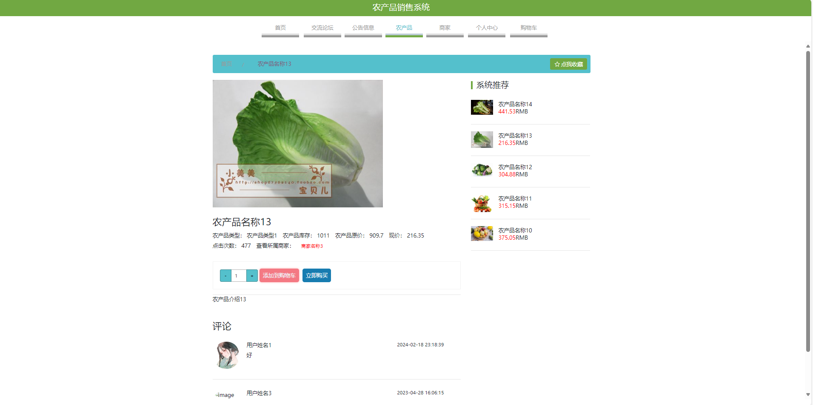
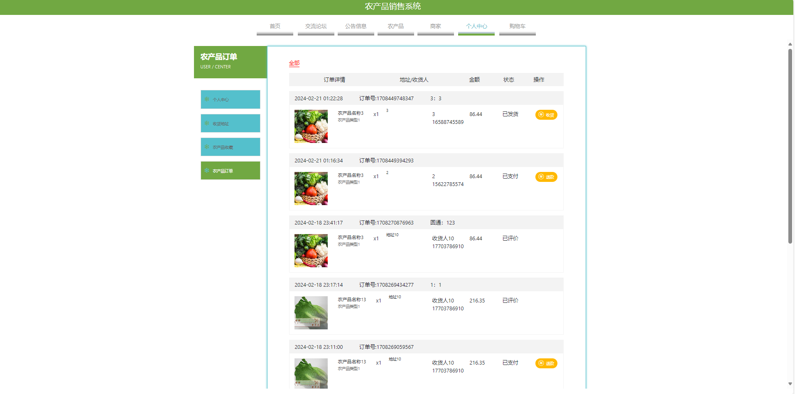
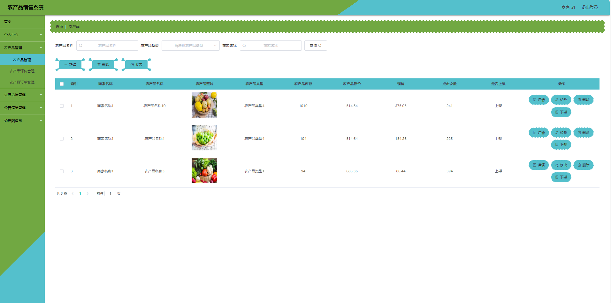
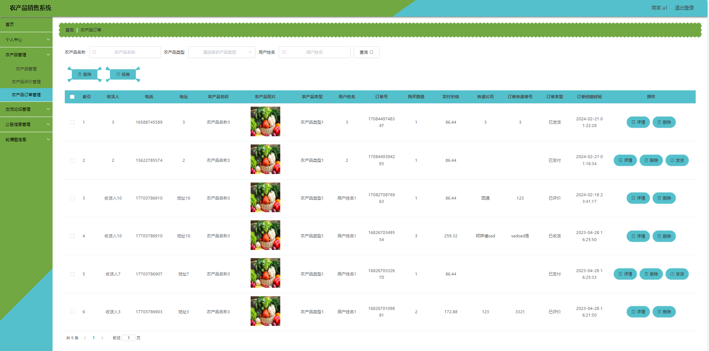

# 农产品销售管理系统

### 9.9￥ 获取完整源码+sql，附赠11000字论文参考，需要加Q：3808981644  或者加微信 ：qszard26
### 有问题，或者需要协助调试运行项目的也可联系
### 获取更多项目，关注公众号：编程项目集

## 一、项目介绍

基于springboot+vue的农产品销售管理系统

开发语言：java

运行环境:idea或eclipse 数据库:mysql

主要技术: Springboot,mybatis,mysql,vue,html

角色:用户 商家 管理员

用户：注册、登录、首页、论坛交流、公告信息、农产品展示、商家展示、个人中心：余额充值、收货地址、农产品收藏、农场品订单、购物车

商家：注册、登录、个人信息、农产品管理、农产品评价管理、农产品订单管理、交流论坛管理、公告信息管理、轮播图管理

管理员：登录、个人信息、管理员管理、用户管理、农产品管理、农产品评价管理、农产品收藏管理、农产品订单管理、交流论坛管理、公告信息管理、公告类型管理、农产品类型管理、商家信用类型管理、轮播图管理

## 二、11000论文参考

## 三、部分功能界面展示

### 9.9￥ 获取完整源码+sql，附赠11000字论文参考，需要加Q：3808981644  或者加微信 ：qszard26
### 有问题，或者需要协助调试运行项目的也可联系

